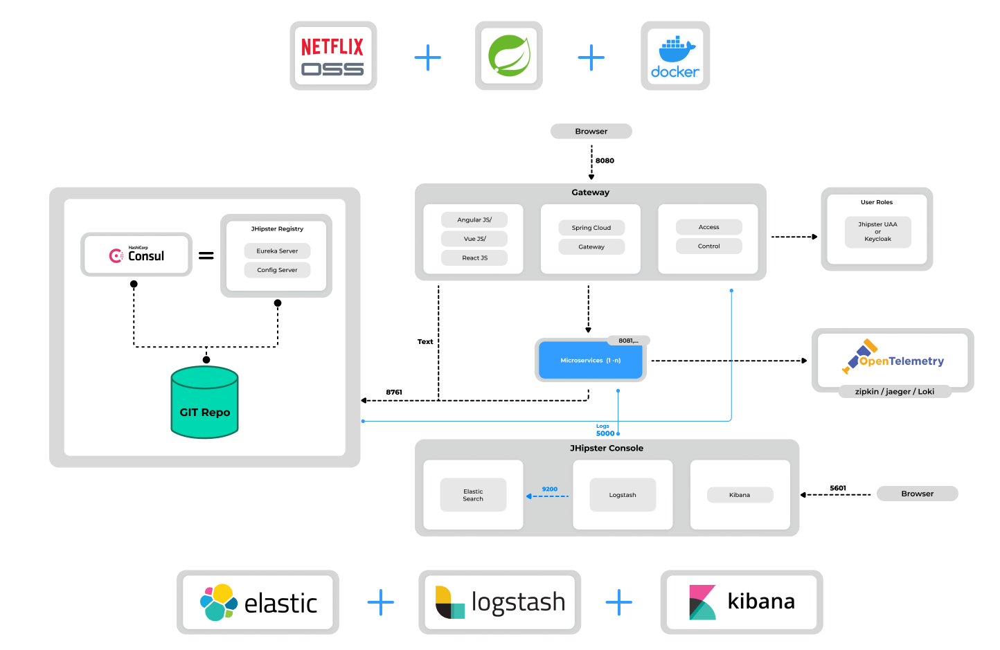

# Microservices Architecture
Implementing a microservices architecture with the Spring Framework involves using various Spring projects and technologies. 
Here's a simplified overview of the steps involved:

1. Spring Boot:
- Use Spring Boot to create standalone, production-grade Spring-based applications. It simplifies the process of building and deploying microservices by providing defaults for configurations and allowing quick setup.

2. Spring Cloud:
- Spring Cloud provides tools and libraries for building distributed systems. Key components include:
  - Service Discovery (Eureka): Enables services to register and discover each other.
  - API Gateway (Zuul or Spring Cloud Gateway): Acts as an entry point for requests, routing them to the appropriate services.
  - Config Server: Centralized configuration management for microservices.
  - Load Balancing: Distributes requests across instances of a service for improved performance and resilience.
  - Circuit Breaker (Hystrix): Handles faults and failures in a graceful way, preventing them from cascading through the system.

3. Spring Data:
- Use Spring Data to simplify data access for microservices. It supports various databases and provides a consistent programming model.

4. Spring Security:
- Implement security features using Spring Security to control access to microservices. It allows you to secure endpoints, implement authentication, and manage authorization.

5. Spring Cloud Sleuth and Zipkin:
- For distributed tracing, integrate Spring Cloud Sleuth with Zipkin. This helps track requests as they traverse through different microservices.

6. Spring RESTful APIs:
- Develop RESTful APIs for communication between microservices. Use Spring MVC or Spring WebFlux for building robust and scalable APIs.

Here's a high-level example:
- Service Registration:
  - Use Eureka for service registration. Each microservice registers itself with the Eureka server, making it discoverable by other services.
- API Gateway:
  - Implement an API Gateway (e.g., Zuul or Spring Cloud Gateway) to handle external requests and route them to the appropriate microservices.
- Config Server:
  - Use a centralized Config Server to manage configurations for microservices.
- Database Access:
  - Use Spring Data to interact with databases. Each microservice manages its database, ensuring autonomy.
- Security:
  - Implement security features using Spring Security to control access to microservices.
- Distributed Tracing:
  - Integrate Spring Cloud Sleuth and Zipkin for distributed tracing, allowing you to track requests across microservices.
- Containerization and Orchestration:
  - Consider using Docker for containerization and Kubernetes for orchestration to simplify deployment and scaling.

# Microservices with JHipster

## Microservices architecture overview
The JHipster microservices architecture works in the following way:
- A [gateway](https://www.jhipster.tech/api-gateway/) is a JHipster-generated application (using the microservice gateway type) designed to handle web traffic and serve an Angular, React, or Vue application. While you can have multiple gateways following the [Backends for Frontends pattern](https://www.thoughtworks.com/insights/blog/bff-soundcloud), it's not required. The gateway is built on the Spring Cloud Gateway library and supports both MVC and WebFlux frameworks.
- [Consul](https://www.jhipster.tech/consul/) is a service discovery service, as well as a key/value store.
- The [JHipster Registry](https://www.jhipster.tech/jhipster-registry/) is a runtime application on which all applications registers and get their configuration from. It also provides runtime monitoring dashboards. It can be used as an alternative to Consul. `(deprecated)`
- [Microservices](https://www.jhipster.tech/creating-microservices/) are JHipster-generated applications (using application type microservice application when you generate them), that handle REST requests. They are stateless, and several instances of them can be launched in parallel to handle heavy loads.

This diagram illustrates a microservices architecture utilizing **JHipster**, incorporating key technologies such as **Netflix OSS**, **Spring Cloud**, and **Docker**. It features a gateway for **handling web traffic** and **user authentication**, microservices for backend operations, and comprehensive **monitoring** and **logging** with tools like **OpenTelemetry**, **Elasticsearch**, **Logstash**, and **Kibana**.

