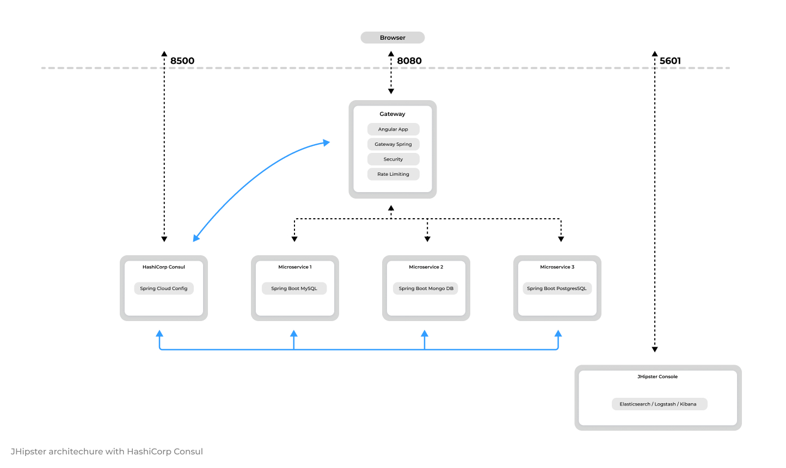

# Resilient API Gateway
Making an API Gateway resilient in a microservices architecture is essential for ensuring system stability, availability, and graceful degradation during service failures or network issues.
Below are the key strategies and technologies you can use to make an API Gateway resilient:

## ✅ 1. Use a Robust API Gateway
Popular resilient API Gateways:
- Spring Cloud Gateway
- Kong
- NGINX
- Istio (Service mesh, but can act like a gateway)
- AWS API Gateway
- Apigee

## ✅ 2. Implement Circuit Breaker
Prevent cascading failures when a downstream service is unavailable.
- Spring Cloud Gateway + Resilience4j
- Istio has built-in circuit breaking

Example (Spring Cloud Gateway + Resilience4j):
```
spring:
    cloud:
        gateway:
            routes:
                - id: product-service
                    uri: lb://product-service
                    predicates:
                        - Path=/products/**
                    filters:
                        - name: CircuitBreaker
                        args:
                            name: productServiceCB
                            fallbackUri: forward:/fallback/products
```

## ✅ 3. Rate Limiting
Protect backend services from abuse or accidental overload.
- Built-in filters in Spring Cloud Gateway
- Kong, NGINX, and AWS API Gateway support rate limiting.

Example (Redis-backed rate limiter):
```
filters:
- name: RequestRateLimiter
  args:
      redis-rate-limiter.replenishRate: 10
      redis-rate-limiter.burstCapacity: 20
      key-resolver: "#{@ipKeyResolver}"
```

Rate Limiting Resolver Bean
```
@Configuration
public class RateLimiterConfig {

    @Bean
    KeyResolver ipKeyResolver() {
        return exchange -> Mono.just(
            exchange.getRequest().getRemoteAddress().getAddress().getHostAddress());
    }
}
```

## ✅ 4. Retries with Backoff
Automatically retry failed requests with delay.

Example (Spring Cloud Gateway):
```
filters:
- name: Retry
  args:
  retries: 3
  statuses: BAD_GATEWAY, SERVICE_UNAVAILABLE
  backoff:
      firstBackoff: 100ms
      maxBackoff: 1s
      factor: 2
```

## ✅ 5. Timeouts
Avoid hanging requests by setting timeouts for upstream calls.

Example (application.yaml for Spring Cloud Gateway):
```
spring:
    cloud:
        gateway:
            httpclient:
                connect-timeout: 2000
                response-timeout: 3s
```

## ✅ 6. Fallback Mechanism
Return a default response when a service is down.

Example:
```
@RestController
public class FallbackController {
    @GetMapping("/fallback/products")
    public ResponseEntity<String> fallback() {
        return ResponseEntity.ok("Product service is currently unavailable. Please try later.");
    }
}
```

## ✅ 7. Complete application.yml Configuration
```
spring:
    cloud:
        gateway:
            routes:
                - id: product-service
                    uri: lb://product-service
                    predicates:
                      - Path=/products/**
                    filters:
                      - name: CircuitBreaker
                          args:
                              name: productServiceCB
                              fallbackUri: forward:/fallback/products
                      - name: Retry
                          args:
                              retries: 3
                              statuses: BAD_GATEWAY, SERVICE_UNAVAILABLE
                              backoff:
                                  firstBackoff: 100ms
                                  maxBackoff: 1s
                                  factor: 2
                      - name: RequestRateLimiter
                          args:
                              redis-rate-limiter.replenishRate: 10
                              redis-rate-limiter.burstCapacity: 20
                              key-resolver: "#{@ipKeyResolver}"
        
            httpclient:
              connect-timeout: 2000
              response-timeout: 3s
```

## ✅ 8. Service Discovery Integration
Use service discovery (like Eureka, Consul, or Kubernetes DNS) to handle dynamic scaling and availability.

If you're using **Eureka** or **Consul**, make sure your services are registered and `uri` uses the `lb://` prefix.
```
eureka:
    client:
    service-url:
    defaultZone: http://localhost:8761/eureka/
```

## ✅ 9. Load Balancing
API Gateway should support client-side or server-side load balancing to distribute traffic across instances.
- Spring Cloud Gateway uses **Ribbon** or **LoadBalancerClient**
- Istio and Kong support L7 load balancing

## ✅ 10. Health Checks and Monitoring
Regularly monitor the health of the services and the gateway itself.
- Use **Spring Boot Actuator**
- Use **Prometheus + Grafana** or **Elastic Stack** for observability
- Integrate with **Zipkin** or **Jaeger** for tracing

## ✅ 11. Graceful Degradation
Design fallbacks that offer partial service instead of total failure (e.g., cached data or static fallback).

## ✅ Example Architecture Stack
| Component         | Tool/Technology                  |
| ----------------- | -------------------------------- |
| API Gateway       | Spring Cloud Gateway or Kong     |
| Circuit Breaker   | Resilience4j or Istio            |
| Service Discovery | Eureka / Kubernetes DNS / Consul |
| Rate Limiting     | Redis + RequestRateLimiter       |
| Monitoring        | Prometheus + Grafana / Zipkin    |
| Retry & Timeout   | Built-in filters or Resilience4j |

## ✅ Summary Table
| Feature            | Spring Cloud Gateway Support         |
| ------------------ | ------------------------------------ |
| Circuit Breaker    | ✅ Resilience4j CircuitBreaker filter |
| Retry with Backoff | ✅ Retry filter                       |
| Fallback Responses | ✅ `fallbackUri` or controller        |
| Rate Limiting      | ✅ Redis-backed filter                |
| Timeout            | ✅ `httpclient.response-timeout`      |
| Service Discovery  | ✅ via Eureka, Consul, or Kubernetes  |
| Monitoring         | ✅ Actuator + Prometheus + Zipkin     |

##  Integrate Security into Spring Cloud Gateway
To integrate security into Spring Cloud Gateway, you typically use **Spring Security** with support for:
- ✅ JWT token validation (e.g., OAuth2 resource server)
- ✅ Authentication and authorization
- ✅ Path-based access control
- ✅ Integration with Identity Providers (Keycloak, Auth0, Okta, etc.)

### ✅ application.yml Configuration
Here's an example that:
- Validates JWT tokens
- Secures all routes
- Allows public access to `/auth/**` and `/fallback/**`

```
spring:
    security:
        oauth2:
            resourceserver:
                jwt:
                    jwk-set-uri: https://YOUR_AUTH_PROVIDER/.well-known/jwks.json

cloud:
    gateway:
        default-filters:
            - TokenRelay
        routes:
            - id: product-service
                uri: lb://product-service
                predicates:
                    - Path=/products/**
                filters:
                    - name: CircuitBreaker
                        args:
                            name: productServiceCB
                            fallbackUri: forward:/fallback/products
            - id: auth-service
                uri: lb://auth-service
                predicates:
                    - Path=/auth/**
```

Replace `https://YOUR_AUTH_PROVIDER/.well-known/jwks.json` with the actual endpoint from your OAuth2 provider like **Keycloak**, **Okta**, **Auth0**, or **Azure AD**.

### Configure Security Filter Chain
Create a class to define which endpoints are public and which require authentication:
```
@EnableWebFluxSecurity
public class SecurityConfig {

    @Bean
    public SecurityWebFilterChain securityWebFilterChain(ServerHttpSecurity http) {
        return http
            .csrf(ServerHttpSecurity.CsrfSpec::disable)
            .authorizeExchange(exchanges -> exchanges
                .pathMatchers("/auth/**", "/fallback/**").permitAll()
                .anyExchange().authenticated()
            )
            .oauth2ResourceServer(oauth2 -> oauth2
                .jwt(Customizer.withDefaults())
            )
            .build();
    }
}
```

### ✅ Forward JWT to Downstream Services
Use TokenRelay filter to forward the access token to downstream services:
```
spring:
    cloud:
        gateway:
            default-filters:
                - TokenRelay
```

### ✅ Testing with Keycloak (Example)
If you're using Keycloak:

JWK URI: http://localhost:8080/realms/<realm-name>/protocol/openid-connect/certs

You can get this from the Keycloak realm’s OpenID configuration URL:
```
http://localhost:8080/realms/<realm-name>/.well-known/openid-configuration
```

### ✅ Summary
| Feature                       | Configuration                                                |
| ----------------------------- | ------------------------------------------------------------ |
| Secure endpoints              | `SecurityWebFilterChain` with path-based access control      |
| JWT token validation          | `oauth2.resourceserver.jwt.jwk-set-uri`                      |
| Forward token to services     | `TokenRelay` filter                                          |
| Permit fallback/auth paths    | `.pathMatchers("/auth/**", "/fallback/**").permitAll()`      |
| Integrate with Keycloak/Auth0 | Use their `.well-known/openid-configuration` for JWT JWK URL |


## Deploy Spring Cloud Gateway to Kubernetes
To deploy Spring Cloud Gateway to Kubernetes, you'll need to:

### ✅ 1. Containerize the API Gateway App
➤ Dockerfile (for Spring Boot app with Spring Cloud Gateway)
```
FROM eclipse-temurin:17-jdk-alpine
VOLUME /tmp
COPY target/gateway-0.0.1-SNAPSHOT.jar app.jar
ENTRYPOINT ["java","-jar","/app.jar"]
```
➤ Build & Push Image
```
# Build Docker image
docker build -t your-dockerhub-username/spring-cloud-gateway:latest .

# Push to Docker Hub
docker push your-dockerhub-username/spring-cloud-gateway:latest
```

### ✅ 2. Create Kubernetes Deployment & Service
➤ deployment.yaml
```
apiVersion: apps/v1
kind: Deployment
metadata:
    name: api-gateway
spec:
    replicas: 2
    selector:
        matchLabels:
            app: api-gateway
    template:
        metadata:
            labels:
                app: api-gateway
        spec:
            containers:
                - name: api-gateway
                    image: your-dockerhub-username/spring-cloud-gateway:latest
                    ports:
                        - containerPort: 8080
                    env:
                        - name: SPRING_PROFILES_ACTIVE
                            value: kubernetes
                        - name: EUREKA_CLIENT_SERVICEURL_DEFAULTZONE
                            value: http://eureka-service:8761/eureka/
```

➤ service.yaml
```
apiVersion: v1
kind: Service
metadata:
    name: api-gateway
spec:
    type: LoadBalancer  # or NodePort if not using cloud provider
    selector:
        app: api-gateway
    ports:
        - protocol: TCP
            port: 80
            targetPort: 8080
```

### ✅ 3. (Optional) ConfigMap for External Configuration
```
apiVersion: v1
kind: ConfigMap
metadata:
    name: api-gateway-config
data:
    application.yml: |
        spring:
            application:
                name: api-gateway
            cloud:
                gateway:
                    routes:
                        - id: product-service
                            uri: http://product-service:8081
                            predicates:
                                - Path=/products/**
```
Mount this into your deployment using volumeMounts.

### ✅ 4. Ingress Controller (Optional, Advanced)
Use **NGINX Ingress** or **Traefik** for routing external traffic.

Example (ingress.yaml):
```
apiVersion: networking.k8s.io/v1
kind: Ingress
metadata:
    name: api-gateway-ingress
    annotations:
        nginx.ingress.kubernetes.io/rewrite-target: /
spec:
    rules:
        - host: api.example.com
            http:
                paths:
                    - path: /
                        pathType: Prefix
                        backend:
                            service:
                                name: api-gateway
                                port:
                                    number: 80
```
Make sure DNS or `/etc/hosts` points `api.example.com` to your LoadBalancer IP or NGINX Ingress IP.

### ✅ 5. Apply All YAML Files
```
kubectl apply -f deployment.yaml
kubectl apply -f service.yaml
kubectl apply -f ingress.yaml  # if using Ingress
```

### ✅ 6. Verify Deployment
```
kubectl get pods
kubectl get svc api-gateway
kubectl logs -f <api-gateway-pod>
```

Access the service:
- Using LoadBalancer: http://<external-ip>/
- Using Ingress: http://api.example.com/

### ✅ Optional Enhancements
| Feature            | How to Add                                                          |
| ------------------ | ------------------------------------------------------------------- |
| Eureka Integration | Add Eureka Discovery + set `uri: lb://<service>`                    |
| TLS/HTTPS          | Use Ingress with TLS + cert-manager                                 |
| JWT Authentication | Already set up in previous messages (resource server + jwk-set-uri) |
| Prometheus/Grafana | Add Actuator + Prometheus scrape config                             |
| Auto Scaling       | Add Horizontal Pod Autoscaler (HPA) using CPU/memory thresholds     |


# The JHipster API Gateway

## Architecture diagram


## HTTP requests routing using the gateway
When the gateways and the microservices are launched, they will register themselves in the **Consul service registry**.
The gateway will automatically proxy all requests to the microservices, using their application name: for example, when microservices `app1` is registered, it is available on the gateway on the `/services/app1` URL.
For example, if your gateway is running on `localhost:8080`, you could point to http://localhost:8080/services/app1/api/foos to get the `foos` resource served by microservice `app1`.
If several instances of the same service are running, the gateway will get those instances from the Service Registry and load balance HTTP requests using [Consul](https://www.consul.io/use-cases/load-balancing). You can access a detailed list of running microservices, including their IP addresses, Git version, status, and more, at http://localhost:8080/api/gateway/routes.

## Security
Standard JHipster security options are detailed on this [security documentation page](https://www.jhipster.tech/security/). However, securing a microservice architecture has some specific tunings and options, which are detailed here.

### JWT (JSON Web Token)
JWT (JSON Web Token) is an industry standard, easy-to-use method for securing applications in a microservices architecture.
JHipster uses the [JJWT library](https://github.com/jwtk/jjwt), provided by Okta, for implementing JWT.
Tokens are generated by the gateway, and sent to the underlying microservices: as they share a common secret key, microservices are able to validate the token, and authenticate users using that token.
Those tokens are self-sufficient: they have both authentication and authorization information, so microservices do not need to query a database or an external system. This is important in order to ensure a scalable architecture.

## Rate limiting
This is an advanced feature that uses [Bucket4j](https://github.com/vladimir-bukhtoyarov/bucket4j) and [Hazelcast](https://hazelcast.com/) to provide quality of service on microservices.
Gateways provide rate-limiting features, so the number of REST requests can be limited:
- by **IP address (for anonymous users)**
- by **user login (for logged-in users)**

JHipster will then use [Bucket4j](https://github.com/vladimir-bukhtoyarov/bucket4j) and [Hazelcast](https://hazelcast.com/) to calculate request counts, and will send **HTTP 429 (too many requests)** errors when the limit is exceeded. The default limit per user is **100,000 API calls per hour**.
This is an important feature, to protect a microservice architecture from being flooded by a specific user's requests.
As the gateway secures the REST endpoints, it has full access to the user's security information, so it can be extended to provide specific rate limits depending on the user's security roles.
To enable rate limiting, open up the `application-dev.yml` or `application-prod.yml` file and set enabled to `true`:
```
jhipster:
    gateway:
        rate-limiting:
            enabled: true
```

Data is stored in Hazelcast, so it is possible to scale gateways as long as the Hazelcast distributed cache is configured, which should work out-of-the-box:
- All gateways have Hazelcast configured by default

If you want to add more rules, or modify the existing rules, you need to code them in the `RateLimitingFilter` class. Examples of modifications could be:
- Lowering the limit of HTTP calls
- Adding limits per minute or per day
- Removing all limits for "admin" users

## Access control policy
By default all registered microservices are available through the gateway. If you want to exclude a specific API from being exposed through the gateway, you can use the gateway's specific access control policy filter. It is configurable using the `jhipster.gateway.authorized-microservices-endpoints` key in the `application-*.yml` files:
```
jhipster:
    gateway:
        authorized-microservices-endpoints: # Access Control Policy, if left empty for a route, all endpoints will be accessible
            app1: /api,/v2/api-docs # recommended dev configuration
```

For example, if you only want the `/api/foo` endpoint of microservice `bar` to be available:
```
jhipster:
    gateway:
        authorized-microservices-endpoints:
            bar: /api/foo
```

## Enabling TLS for Gateway Security
By default, the gateway operates over unsecured HTTP. For production environments, it's recommended to enable TLS for enhanced security. To do this, uncomment the provided code snippet, under `application-prod.yml`. This will utilize a self-signed TLS certificate located in `config/tls` with the filename `keystore.p12`, or you can specify your own keystore with a predefined password.
```
server:
    port: 443
    ssl:
        key-store: classpath:config/tls/keystore.p12
            key-store-password: password
            key-store-type: PKCS12
                key-alias: selfsigned
            # The ciphers suite enforce the security by deactivating some old and deprecated SSL cipher, this list was tested against SSL Labs (https://www.ssllabs.com/ssltest/)
            ciphers: TLS_ECDHE_RSA_WITH_AES_128_CBC_SHA,TLS_ECDHE_RSA_WITH_AES_256_CBC_SHA,TLS_ECDHE_RSA_WITH_AES_128_GCM_SHA256,TLS_ECDHE_RSA_WITH_AES_256_GCM_SHA384 ,TLS_DHE_RSA_WITH_AES_128_GCM_SHA256 ,TLS_DHE_RSA_WITH_AES_256_GCM_SHA384 ,TLS_ECDHE_RSA_WITH_AES_128_CBC_SHA256,TLS_ECDHE_RSA_WITH_AES_256_CBC_SHA384,TLS_DHE_RSA_WITH_AES_128_CBC_SHA256,TLS_DHE_RSA_WITH_AES_128_CBC_SHA,TLS_DHE_RSA_WITH_AES_256_CBC_SHA256,TLS_DHE_RSA_WITH_AES_256_CBC_SHA,TLS_RSA_WITH_AES_128_GCM_SHA256,TLS_RSA_WITH_AES_256_GCM_SHA384,TLS_RSA_WITH_AES_128_CBC_SHA256,TLS_RSA_WITH_AES_256_CBC_SHA256,TLS_RSA_WITH_AES_128_CBC_SHA,TLS_RSA_WITH_AES_256_CBC_SHA,TLS_DHE_RSA_WITH_CAMELLIA_256_CBC_SHA,TLS_RSA_WITH_CAMELLIA_256_CBC_SHA,TLS_DHE_RSA_WITH_CAMELLIA_128_CBC_SHA,TLS_RSA_WITH_CAMELLIA_128_CBC_SHA
```

Keep in mind that `enabling TLS` on the server `might introduce some performance overhead`. If possible, `consider using a load balancer outside the gateway with SSL termination to handle encryption`, which can help mitigate this performance impact.
