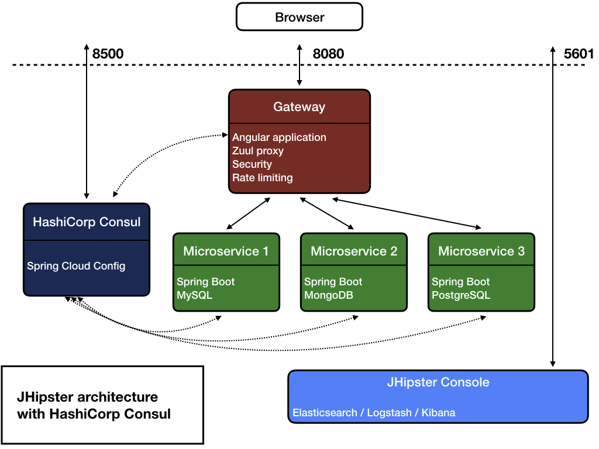

# Service Registry with Consul

## Consul overview
[Consul](https://www.consul.io/) is used as the default service registry solution. Compared to Eureka it has a number of advantages:
- It is easier to operate in a multi-node cluster than Eureka.
- It favors consistency over availability so changes in the state of your cluster are propagated more quickly.
- Consul service discovery can interoperate with existing applications through its [DNS interface](https://www.consul.io/docs/agent/dns.html) or [HTTP API](https://www.consul.io/docs/agent/http.html).

## Architecture diagram


## Getting started
To get started with developing applications that rely on a Consul registry, you can start a Consul instance in a docker container:
- run `docker-compose -f src/main/docker/consul.yml up -d` to start a Consul server in `dev` mode. Consul will then be available on port `8500` of your Docker host, so if it runs on your machine it should be at http://127.0.0.1:8500/.

You can also use the [Docker Compose subgenerator](https://www.jhipster.tech/docker-compose/#generating-a-custom-docker-compose-configuration-for-multiple-applications) to generate a docker configuration for several consul-enabled applications.

## Application configuration with Consul
If you have chosen the Consul option when generating your JHipster microservice or gateway app, they will be automatically configured to retrieve their configuration from Consul's **Key/Value** store.

The Key/Value (K/V) store can be modified using either its UI available at http://localhost:8500/v1/kv/ or its [REST API](https://www.consul.io/intro/getting-started/kv.html). However changes made this way are temporary and will be lost on Consul server/cluster shutdown. So, in order to help you interact with the Key/Value store and manage your configuration as YAML files, the JHipster Team has developed a small tool: the [consul-config-loader](https://github.com/jhipster/consul-config-loader). The **consul-config-loader** is automatically configured when starting Consul from the `consul.yml` docker-compose file but it can also be run as a standalone tool. It can be run in two modes:
- a **dev** mode, where YAML files from the `central-server-config` directory are automatically loaded into Consul. Moreover any change to this directory will be immediately synchronized with Consul.
- a **prod** mode, that uses Git2Consul to setup the YAML files contained in a Git repository as a configuration source for the Key/Value store.

Note that as with the JHipster Registry, your configuration files will need to be named `appname-profile.yml` where appname and profile correspond to the application’s name and profile of the service that you want to configure. For example, adding properties in a `consulapp-prod.yml` file will set those properties only for the application named `consulapp` started with a `prod` profile. Moreover, properties defined in `application.yml` will be set for all your applications.

# Resilient Consul Service Registry
This how HashiCorp Consul works as a resilient service registry, and how to make it more fault-tolerant in microservices architecture.

## 🧭 What is Consul?
Consul is a service discovery and service mesh tool that allows services to register themselves and discover others using DNS or HTTP. It also provides health checking, key-value storage, and secure service communication.

## 🛡️ Resilience Features of Consul
1. Health Checking
- Consul performs **regular health checks** on services.
- If a service fails its health check, it’s **marked as unavailable** and won’t be returned in discovery queries.

2. High Availability (HA)
- Consul supports a **multi-server cluster (leader + followers)**.
- If the leader goes down, a **new leader is elected**.
- You can run **3–5 servers** for high availability and fault tolerance.

3. Decentralized Architecture
- Each node runs a **Consul agent**, either in client or server mode.
- Clients don’t need to know the full topology; they communicate with a local agent.

4. Service Discovery with Load Balancing
- Multiple service instances are registered.
- When queried, Consul can return **only healthy instances**, enabling client-side load balancing.

5. Data Replication and Gossip Protocol
- Consul uses **Serf (gossip protocol)** for node discovery and failure detection.
- R**aft consensus protocol** ensures consistency across server nodes.

6. DNS and HTTP APIs for Lookup
- Services can resolve `my-service.service.consul` via DNS.
- Also accessible via HTTP APIs like `GET /v1/catalog/service/my-service`.

## 🔧 Making Consul More Resilient
- **Run 3 or 5 Consul servers** in different availability zones.
- Enable ACLs to secure the registry.
- Use **service health checks** aggressively for accurate service status.
- Integrate with **Envoy sidecars** (Consul Connect) to enable mTLS and retries.
- Use **blocking queries** to reduce load and get near-real-time updates.

## 🧪 Example: Service Registration
```
PUT /v1/agent/service/register
{
    "Name": "payment-service",
    "ID": "payment1",
    "Address": "10.0.0.2",
    "Port": 8080,
    "Check": {
        "HTTP": "http://10.0.0.2:8080/health",
        "Interval": "10s"
    }
}
```

## ⚙️ Integrating with Spring Boot
Use Spring Cloud Consul to integrate:
```
spring:
    cloud:
        consul:
            host: localhost
            port: 8500
            discovery:
                register: true
                service-name: my-spring-service
```

## 📌 Summary
| Feature           | Purpose                                             |
| ----------------- | --------------------------------------------------- |
| Health checks     | Prevent routing to unhealthy services               |
| HA server cluster | Keeps registry resilient in face of server failures |
| Service discovery | Allows services to dynamically discover each other  |
| Gossip protocol   | Decentralized failure detection                     |
| ACLs + mTLS       | Secures and validates service communication         |

