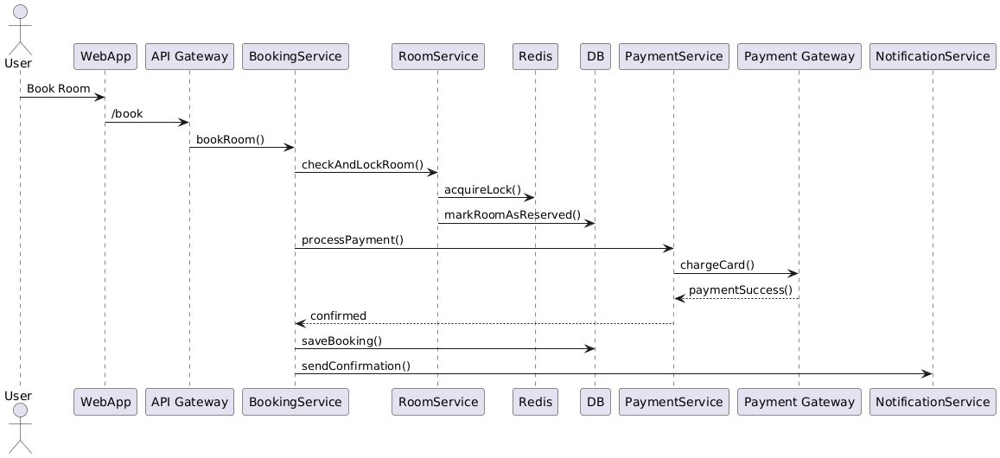

# System Design - Hotel Booking

Let's walk through a Hotel Booking System design—step-by-step, with a clear diagram and details on components, data flow, scalability, consistency, and trade-offs.

## ✅ System Design Question
Design a hotel booking system where users can:
* Search for hotels and available rooms
* Book rooms
* Cancel bookings
* See their booking history

The system should support:
* Multiple users
* High concurrency (especially during peak seasons)
* OTA sync (Booking.com, Traveloka, etc.)
* Avoid double booking (overbooking)

## 🔷 1. High-Level Features
| Feature      | Description                         |
| ------------ | ----------------------------------- |
| Hotel Search | Filter by location, date, room type |
| Booking      | Reserve available room              |
| Cancellation | Cancel upcoming booking             |
| OTA Sync     | Sync inventory with 3rd party OTAs  |
| Notification | Send confirmation via email/SMS     |
| Admin Panel  | For hoteliers to manage properties  |

## 🔷 2. High-Level Architecture Diagram
### 🟦 Hotel Search Flow


### 🟩 Booking Flow


### 🟨 Hotelier Admin Panel Flow


### 🟥 OTA Sync Flow


## 🔷 3. Core Microservices
| Service                  | Responsibility                             |
| ------------------------ | ------------------------------------------ |
| **API Gateway**          | Routes and secures API calls               |
| **Search Service**       | Combines hotel + room info                 |
| **Hotel Service**        | Info on hotel metadata                     |
| **Room Service**         | Availability, pricing, lock mechanism      |
| **Booking Service**      | Orchestrates the booking flow              |
| **Payment Service**      | Interfaces with Stripe/Midtrans            |
| **Notification Service** | Emails/SMS                                 |
| **Inventory Service**    | Hotelier’s room management                 |
| **OTA Sync Service**     | Bidirectional OTA sync (Booking.com, etc.) |

## 🔷 4. Avoiding Double Booking
Use Redis distributed lock with `room_id + date` as key:
* When a user tries to book:
  * Acquire lock in Redis: `lock:room:123:2025-12-20`
  * Check availability in DB/cache
  * Deduct room count atomically
  * Release lock

Fail-fast if another booking is in process.

## 🔷 5. OTA Sync Strategy
* **Polling** or **Webhook**-based sync from OTA
* Daily full sync, incremental delta sync
* OTA-Sync must:
  * Map external `room_id` to internal `room_id`
  * Reconcile availability
  * Invalidate local cache to avoid stale results

## 🔷 6. Cache Strategy
| Layer              | What to Cache                                   |
| ------------------ | ----------------------------------------------- |
| **Search results** | Hotel + rooms by location                       |
| **Availability**   | Redis (room\_id + date)                         |
| **Booking status** | Short-lived cache for recently booked/cancelled |

## 🔷 7. Scalability and Reliability Considerations
| Concern             | Solution                          |
| ------------------- | --------------------------------- |
| High read on search | Use CDN + caching                 |
| Race conditions     | Redis distributed locks           |
| Payment failures    | Rollback booking, release lock    |
| Availability sync   | Eventual consistency with retries |
| Notifications       | Async using Kafka/RabbitMQ        |

## 🔷 8. Trade-offs
| Trade-off                   | Decision                                        |
| --------------------------- | ----------------------------------------------- |
| Consistency vs Availability | Favor strong consistency for bookings           |
| Real-time sync vs Batch     | Use hybrid approach for OTA sync                |
| Monolith vs Microservices   | Microservices for modularity and team scaling   |
| Cache Invalidation          | Use TTL + pub/sub for precision and performance |

## ✅ Summary
This system:
* Prevents overbooking with Redis locks
* Handles 3rd-party sync via a dedicated sync service
* Uses caching and search services for performance
* Breaks down into microservices for scalability

## ✅ Booking with Prevent Overbooking


## ❌ Cancellation


## 🧠 Key Points
* **Redis Locking** is used in the booking process to avoid race conditions.
* **Rollback logic** ensures that on failure (like payment decline), the system returns the room count.
* **Cache invalidation** happens during cancellation or OTA sync to reflect updated availability.

## 🔁 OTA Sync Retry Logic
**Retry Logic for OTA Sync** between your hotel booking system and a third-party OTA provider (e.g., Booking.com or Agoda).


### 🧠 Key Concepts Applied
| Component             | Role                                                    |
| --------------------- | ------------------------------------------------------- |
| `OTASyncScheduler`    | Periodically triggers sync (cron or event-driven)       |
| `OTAAdapter`          | Abstraction layer for different OTA APIs                |
| `RetryQueue`          | Could be Kafka, RabbitMQ DLQ, or in-memory job queue    |
| `Retry Logic`         | Exponential backoff, max retry count (e.g., 3 attempts) |
| `Alerting`            | Triggers alerts after critical failure                  |
| `Rate Limit Handling` | Uses `Retry-After` headers to schedule next try         |

### 💡 Retry Strategy Tips
| Strategy                    | Usage                                    |
| --------------------------- | ---------------------------------------- |
| **Exponential Backoff**     | 1s → 2s → 4s delay for retries           |
| **Jitter**                  | Adds randomness to avoid thundering herd |
| **DLQ (Dead Letter Queue)** | Move failed jobs here after max retries  |
| **Retry-After Respect**     | Comply with OTA rate limits              |
| **Idempotent Updates**      | Ensure re-syncs don’t cause duplication  |


# Q&A

Below is a detailed Q&A guide on:
1. ✅ Cache Strategies
2. ✅ Database Optimization Techniques (e.g., partitioning, materialized views, indexing)

These are commonly asked in system design interviews to evaluate your depth of backend knowledge, especially for high-traffic platforms like booking systems or marketplaces.

## 🧠 1. Cache Strategies

## ❓ Q1: What caching strategy would you use for hotel room availability?
### ✅ Answer:
* Read-through cache (on request):
  * App checks Redis for availability:roomId:date.
  * If miss, reads from DB and populates cache.
* Write-through (on update):
  * When OTA/hotel updates inventory, write to both DB + cache.
* TTL & Invalidation:
  * Set short TTL (e.g., 60s) or invalidate on booking/cancellation.

Example:
```
Key: availability:room:123:2025-08-01 → Value: 4
```


These questions test your understanding of:
* **failure handling**, 
* **consistency**, 
* **data evolution**, 
* **observability**, 
* and **scalability**.

## 🔶 1. How do you handle Redis failure during booking?
### ❓ Why asked:
Redis is used for locking, caching, or rate limiting. What if it’s down or partitioned?

### ✅ Answer:
Option A: Redis used for Locking (e.g., room availability)

* Use fail-fast strategy:
  * If Redis is unavailable, reject booking with a 503 and log the incident.
* Fallback:
  * Use DB-level pessimistic locking (e.g., `SELECT ... FOR UPDATE`) temporarily, but be aware of performance trade-offs.
* Circuit breaker to detect Redis health and auto-disable Redis lock path.
  ```
  // Pseudocode fallback
  try {
      redisLock.acquire()
      // check room and book
  } catch (RedisUnavailableException e) {
      fallbackToDbLock()
  }
  ```
Option B: Redis used for Caching

* If Redis is down:
  * Fallback to primary DB read.
  * Avoid writes to cache.
* Make sure cache client fails silently (e.g., `GET` returns null).

## 🔶 2. What if Redis lock is acquired, but the process crashes before releasing it?
### ✅ Answer:
* Use Redis lock with TTL (Time to Live) to auto-expire stale locks (e.g., 5 seconds).
* Use lock tokens to ensure only the owner can release.
* Optionally, implement lock renewal if operation takes long.

## 🔶 3. How do you evolve the schema without downtime?
### ❓ Why asked:
How do you handle changing the DB schema while users are actively using the system?

### ✅ Answer:
1. Backward-Compatible Changes First
   * Add nullable columns or tables.
   * Don't remove or rename fields in one step.
2. Double-Write or Shadow-Write
   * Write to both old and new schema during transition.
3. Read Compatibility
   * Update code to read from new + old fields (fallback).
4. Deploy in Phases
   * Apply schema changes → deploy code that uses it → clean up.
5. Use Feature Toggles
   * Enable new behavior gradually.

### ✅ Example:
```
-- Step 1: Add new column
ALTER TABLE bookings ADD COLUMN new_status TEXT DEFAULT NULL;

-- Step 2: Update code to write to both `status` and `new_status`

-- Step 3: After migration, drop `status`
```

## 🔶 4. What if two users try to book the last room at the same time?
### ✅ Answer:
Use distributed locking (e.g., Redis `SETNX`) per` roomId + date`.
* Only one user acquires lock → books the room.
* Others retry or fail with error.
* Lock is released once booking finishes or fails.
* Can also use atomic DB operations (e.g., decrement with condition) as backup.

## 🔶 5. What if payment succeeds but DB insert fails? How do you handle partial failures?
### ✅ Answer:
This is a distributed transaction problem.

Approaches:
* 2-phase commit → complex, rarely used.
* Outbox pattern:
  * Write booking + "payment processed" event to DB in one transaction.
  * Separate service picks up event and finishes processing.
* Saga pattern:
  * On failure, send compensating transaction to refund payment.
  * Keep booking state machine (e.g., PENDING → PAID → FAILED).

## 🔶 6. How do you monitor booking reliability and failures?
### ✅ Answer:
Implement observability stack:

| Metric                       | Tool                           |
| ---------------------------- | ------------------------------ |
| Booking success/failure rate | Prometheus + Grafana           |
| Latency of booking flow      | APM (e.g., New Relic, Datadog) |
| Error logs                   | Loki / ELK                     |
| Payment failures             | Custom metrics and alerts      |
| Redis latency/hit ratio      | Redis exporter                 |

Add:
* Tracing using OpenTelemetry
* Structured logs with `booking_id`, `user_id`, `room_id`

## 🔶 7. How to sync inventory with OTA (e.g., Booking.com) and ensure consistency?
### ✅ Answer:
* Use eventual consistency via:
  * Webhooks (OTA notifies you)
  * Periodic polling
* Build OTA Sync Service:
  * Pull availability from OTAs and reconcile
  * Push updates from your DB to OTA
* Use idempotent requests for OTA APIs
* Implement retry logic with backoff (as in earlier diagram)
* Handle mapping between OTA `room_id` and internal IDs

## 🔶 8. What trade-offs would you make for peak-season traffic?
| Concern                   | Trade-off                                                |
| ------------------------- | -------------------------------------------------------- |
| Booking Speed vs Accuracy | Cache aggressively, accept minor inconsistency           |
| Strong Consistency        | Might allow eventual consistency for low-risk operations |
| Search freshness          | Accept stale results (10s cache) to reduce DB load       |
| Locking                   | Use faster, coarser locks to reduce contention           |

## 🔶 9. How would you redesign this system for multi-region availability?
### ✅ Answer:
* Deploy in multi-region Kubernetes clusters.
* Use GeoDNS and load balancers (e.g., Cloudflare, AWS ALB).
* Data layer:
  * Global databases (e.g., CockroachDB) or
  * Leader-follower replication + read locality
* Make booking service region-aware (e.g., EU, US)
* Use eventual consistency for cross-region sync (e.g., OTA sync, analytics)

## 